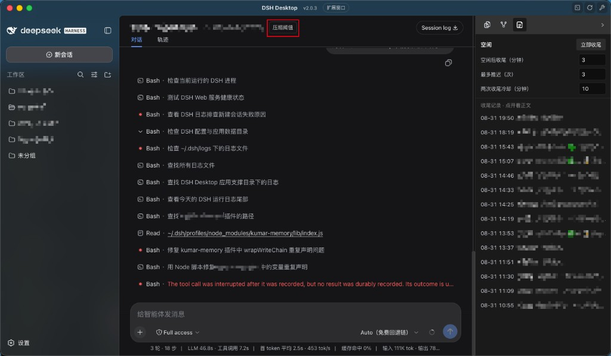
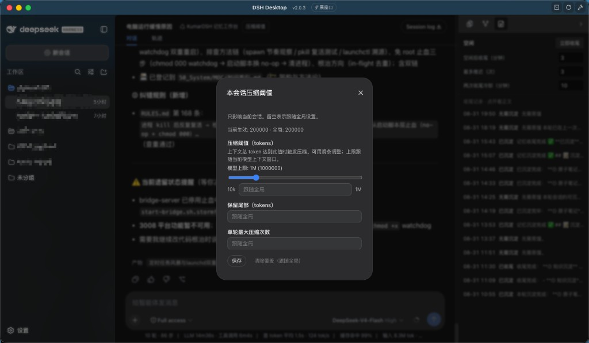
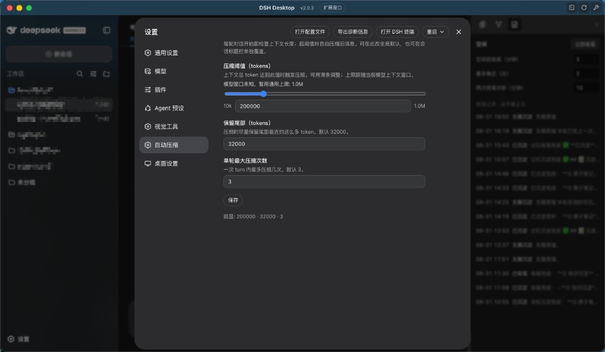

# kur-compact-trigger

**Category / 分类：** `dsh-plugin` · DeepSeek Harness 第三方插件

**Per-session compaction** for [DeepSeek Harness](https://github.com/deepseek-ai/deepseek-harness). Official auto-compact is global only. This plugin lets each chat pick its own threshold from the header — without keeping the settings window open.

**会话级压缩**：官方自动压缩只能调全局。本插件在标题栏给**每个会话**单独设阈值，不必一直开着设置窗。

---

## English

### Why this exists

Official `@deepseek-ai/dsh-compaction-basic` `auto` is a **single global policy** (typically 80% of the model window). Every session shares it.

That is awkward once token prices go up (DeepSeek and others): a long research thread may need a large window, while a short task chat should compact early. Opening Settings for every switch is not how people actually work.

This plugin adds **session-level control**: a compact button on the chat header, optional overrides in `sessions.<id>`, and a global default only as fallback.

It does **not** replace the official summarizer. It decides *when* and *which range* to compact, then calls `compaction.compactRegion()`.

| Setting | Default | Meaning |
|---|---|---|
| `thresholdTokens` | `200000` | Compact when **this session** reaches this many tokens |
| `retainTokens` | `32000` | Keep roughly this many recent tokens verbatim |
| `maxAttempts` | `3` | Max compact loops in one turn |
| `sessions.<id>` | — | Per-session override; empty = follow global |

The compact cut is moved to a **tool-call / tool-result pairing boundary** so a tool result is not split from its call.

Host plane, shared by every preset. Do **not** inject `compaction` (that service lives in the preset realm). At `agent/pre-step` it uses `ctx.agentPresets.serviceFor(agent, 'compaction')`.

### Screenshots

Header — change **this session** without leaving the chat:

Session override — leave fields blank to follow the global default:

Settings → **Auto Compact** — global fallback only; slider max follows the model context window:

### Install

1. Copy this package to `~/.dsh/profiles/node_modules/kur-compact-trigger/` (or clone / `npm pack` into that path).
2. Merge [examples/cordis.patch.yml](examples/cordis.patch.yml) into each profile’s `cordis.patch.yml` (`desktop`, `web`, `feishu`, …).
3. Add [examples/settings.yaml](examples/settings.yaml) under `kur-compact-trigger:` in `~/.dsh/settings.yaml`.
4. Restart DSH Desktop / the profile process.

Tune the global default in **Settings → Auto Compact**. Tune one chat from the header **Compact** control.

### Official auto vs this plugin

| | Official `compaction-basic` auto | This plugin |
|---|---|---|
| Scope | **Global** (one ratio for all sessions) | **Per session**, plus a global default |
| Typical trigger | 80% of the model context window | Absolute token threshold (default 200k) |
| UI | Settings only | Header + Settings |

Both can run. If you want only session-level policy, turn official `auto` off and use this plugin.

### License

MIT

---

## 中文

### 为什么做这个

官方 `@deepseek-ai/dsh-compaction-basic` 的 `auto` **只能控制全局**（通常是模型窗口的 80%）。所有会话共用同一套。

模型（尤其 DeepSeek）涨价之后，长上下文很贵：有的会话需要大窗口慢慢做，有的短任务根本不该带着几十万 token 往下跑。每次去设置页改全局、改完再改回来，也不方便——设置窗不能一直开着。

所以才有**会话级压缩**：标题栏给当前对话单独设阈值；`sessions.<id>` 可覆盖；全局默认只当没覆盖时的兜底。

本插件**不实现摘要模型**，只决定**何时、压哪一段**，再调用官方 `compaction.compactRegion()`。

| 配置 | 默认 | 含义 |
|---|---|---|
| `thresholdTokens` | `200000` | **本会话**总 token 达到此值时压缩 |
| `retainTokens` | `32000` | 尽量保留尾部最近约这么多原文 token |
| `maxAttempts` | `3` | 同一轮最多连压几次 |
| `sessions.<id>` | — | 按会话覆盖；留空跟随全局 |

切分点会挪到**工具调用 / 工具结果配对平衡**处。挂在 **host 平面**；**不要 inject `compaction`**。在 `agent/pre-step` 里用 `ctx.agentPresets.serviceFor(agent, 'compaction')` 取当前 preset。

### 截图

标题栏入口：不离开对话、也不用开设置窗，改**这一路**的阈值：

本会话覆盖；留空则跟随全局：

设置 → **自动压缩**：只是全局兜底；滑条上限跟随模型窗口：

### 安装

1. 把本包放到 `~/.dsh/profiles/node_modules/kur-compact-trigger/`（或 clone / `npm pack`）。
2. 将 [examples/cordis.patch.yml](examples/cordis.patch.yml) 合并进各 profile 的 `cordis.patch.yml`。
3. 在 `~/.dsh/settings.yaml` 写入 [examples/settings.yaml](examples/settings.yaml) 的 `kur-compact-trigger:` 段。
4. 重启 DSH Desktop 或对应 profile。

全局默认在 **设置 → 自动压缩**；单个会话用标题栏 **压缩阈值**。

### 官方自动压缩 vs 本插件

| | 官方 `compaction-basic` auto | 本插件 |
|---|---|---|
| 范围 | **只能全局**（所有会话同一比例） | **会话级** + 全局兜底 |
| 典型触发 | 模型窗口的 80% | 绝对 token 阈值（默认 20 万） |
| 界面 | 只有设置页 | 标题栏 + 设置页 |

两条线可以同时开。若只想按会话控成本，关掉官方 `auto`，只用本插件。

### 许可证

MIT
